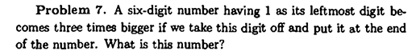

A book about algebra is a one i need to advance my mathematical thinking. It begins with some introduction to basic arithmetic which is very convinient in our decimal system that we know today. 

The first problem that we encounter is the following. Several digits "8" are written and some "+" signs are inserted to get the sum 1000. Figure out how it's done. 

We can write 888 + 88 + 8 + 8 + 8 = 1000 i came about this just by trying to get my hands dirty. 

Multiplication algorithms in the decimal systems are then introduced and the well known stacking method we learned in primary school is presented. 

for example "a boy claims that he can multiply any three-digit number by 1001 instantly. If his classmate says to him "715" he gives the answer immediately. Compute the answer and explain the boy's secret

Multiply 101010101 by 57 that gives 5757575757
Multiply 10001 by 1020304050 that would give 1020304050102030405

The boy's secret is that when the number you multiply by 1001 you have that $n x 1000 = n x 1000 + n x 1 = 1000n+n$ so if $n = 2$ you have $2 x 1000 + 2 x 1 = 2002$. Since $n$ is a three-digit number, 1000$n$ shifts exaclt three places to the left - leaving three empty digit slots that $n$ fills perfectly so the result is just $n$ written twice back-to-back. 

Here is another problem that 

so were looking for a number $n$ is 6 digits and the left most digit of $n$ is 1. We can again form this algrebraically where we let $m$ be the five-digit number formed by the last five digits of $n$ then we have $n = 100000 + m$. 