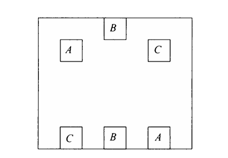
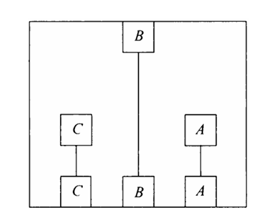
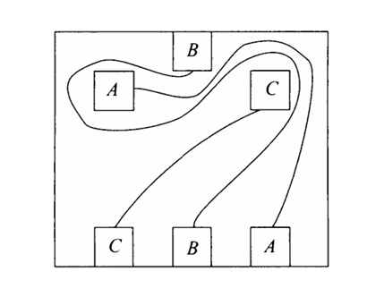

This book is about strategies and tools for problem solving, an interesting area that is important for many purposes. It's important in terms of solving tasks at work and in life in general. In this second chapter Zeitz covers some strategies for investigating problems, because as he writes investigation is really the first place to start. Detective work is always fun and that is what investigation is about. If it was merely an exercise we wouldn't have to do all this work, but as it is a problem we cannot go ahead directly and solve it. 

It's here that Zeitz again reference the mountaneering analogy and describes how it can look overwhelming and daunting to climb a mountain for the inexperienced climber. We need effort, skill and hard work to accomplish it. We need to right strategies and mindset. Zeitz describe how the psychological aspect is important, one that applies to all problems. While they are simple it does not mean they are easy to master, because we have to learn to really work and work hard. 

The first quality we need to learn is **mental toughness** that is to keep trying, experiment even when things seems to going against us every time. The analogy he uses here is that of a mouse in a box where it escaped after trying again and again until it recognized the opening. Try and try again and vary the trails is the mindset we need to have when solving problems. 

We have to have **mental toughness**, **confidence** and **concentration** with us to keep going and then vary our approach every time we try. This is about learning, experimenting and absorbing. 

It's also important to note that some problems cannot be solved and knowing when to give up is an important part of the problem solving art. 

Elon musk have something he calls an algorithm for problem solving which has some of the same flavors as the that of Paul Zeitz. He starts by explaining the that it's about getting clear on the requirements, that means pushing back and questioning if what is initially asked for is actually something that is needed and is useful. 

For example is it useful for me to solve the exercises in math? It's probably better for me to built some data and analytics projects and write in my book about it. 

That's where i have to keep going no matter what. 

Nevertheless lets move on. Having the attitude of **wishful thinking** is as Zeitz say, always fun and often useful. He then showcase that problem of connecting dots between three boxes, something that can seem impossible or overwhelming to begin with. 

Let's use some wishful thinking. Zeitz first ask, why can't we just move the boxes around, so they are aligned number over number? That would make the solution easy right, just draw three straight lines.

Making things simple or easier is a strategy that is important because why makes thing hard that are easy? Now if we pushed the boxes back to their original position we would actually see that there is a solution. 

When we train our problem solving and logical thinking we start to approach problems more with an open-mind and opportunistic attitude. In addition to **mental thoughness** and having a wishful, playful thinking attitude Zeitz also explains that mathematical thinkers also posses **creativity**. The good problem solver and thinker is "*highly open and receptive to ideas that are floating around in plain view, yet invisible to most people*" (p. 34). This passage here had me think about logic and the things i have been reading about logic where i have been studying things like inductive reasoning. This idea of creativity and problem solving being linked got me thinking about those ideas i have been studying in analytical philosophy and how Sherlock Holmes solved mysteries using these creative and observant qualities. 

When i think about it, the use of AI is really boring. To me it kinda ruins the mystery in many cases particularly when it comes to my craft. People are so hyped and it's fair, but i think it's mostly a FOMO thing right now. I want to move in the other direction. If that is really what people want to use their time on then that's fair, just not if it's me. I want to build strategies, have fun and work deeply and i don't want to go into a career where you can just be replaced i want a career where depth is rewarded. 

Returning back from that thought, Zeitz write that mathematicians are *Platonists* to which problem solving is "the art of seeing the solution that is already there" (p. 34).

Zeitz writes that this quality is something we can cultivate and train ourselves to have such that when we see a beautiful solution we think "*Nice idea! It's similar to ones i've had. Let's put it to work!*" to which he follow-up with *Learn to shamelessly appropiate new ideas and make them your own* (p. 35). This is interesting stuff i must say. I like it alot and i believe it's what i want to keep diving into as i don't want AI to do any important stuff for me. It can do groceries and helping me in other ways but i will be in charge here. 

To adopt this open-ness to new things is to stay loose Zeitz say and this is actually interesting becaue i read a book about the science of learning which speaks about how we should shift between opening our minds and letting it wander with focusing deliberately on a specific problem or skill we are trying to master. When we step-back and have this loose, relaxed and almost **periphiral vision** we let our mind absorb things that we might otherwise not. Sometimes concentration can work against us if we concentrate to hard we don't allow our body and mind to be open to new ideas and insights which is important when we want to learn. 

Let's work with an example from the book here refering to example 2.1.4 page 19. 

Pat wants to take a 1.5 meter-long sword onto a train, but the conductor won't allow it as carry-on lugage. And the bagage person won't take any item whose greatest dimension exceed 1 meter. What should Pat do?

He should just drive his car :-) or he could book a seat for it. The solution from the book is to use a 1x1x1 box where the diagonal makes it possible to fit the sword into the box. 

### 2.2 strategies for getting started

Well it can sometimes be overwhelming to get started as the introduction correctly pointed out. The mountain can seem to steep to climb at first sight. Equipped with mental toughness, a loose and open mind we begin to investigate, positive and confident that we will find a solution. 

Often we just see the polished solution, the argument but the investigation and hard work that noone sees is often the heart of the solution. These are full of wrong turns, silly misconceptions and frustrations. This is what Zeitz explain here and i must agree that it really is a exceptionally great point. In anything where people have succeed whether professional athletes, a solution to a problem often we don't see the hard work that actually was what made the solution appear. It's the training everyday full of struggles or the work that noone wants to do, which makes someone succeed. Only when they succeed we see it and then assume they must have some special talent. 

That is the nature of problem solving as Zeitz write "You don't get rewarded with the flash of insight until you have paid your dues by prolonged, sometimes fruitless toil". (p. 26) We are often to quick to give up because we don't get rewarded immediately or because the mountain looks to steep to climb. 

Zeitz has some specific suggestion as to what we can do at the beginning of every problem which he states that the first step is **orientation**. He writes

* Read the problem carefully. Pay attention to details such as positive vs negatieve, finite vs infinite etc.
* Begin to classif is it a "to find" or "to prove" problem? Is the problem similar to others you have seen?
* Carefully identify the hypothesis and the conclusion
* Try some quick preliminary brainstorming:
- THink about convenient notation
- Does a particular method of argument seem plausible?
- Can you guess the solution?

Go back and reread and perhaps restate or reframe the question. 

After that it's time to **get your hands dirty** while keeping and open, curious, loose and relaxed mind having that playful **wishful thinking** attitude. Make it easy and simple, have fun. Play around with it. As Zeitz write, "it's a well kept secret that much high-level mathematics research is the result of low-tech "plug and chug" methods" (p. 27) here he refers to we might plug in numbers, stay loose and play around with stuff until we might see a pattern. Yes it's requires hard work and a lot of repetition but so does anything you want to succeed at. 

*Time spent thinking about a problem is always time worth spent. Even if you seem to make no progress at all* 

Zeitz introduces some example problems for example he presents example 2.2.1 where you are asked to determine $a_{1995}$ for all nonnegative integers $m$ and $n$ with $m \ge n$. If $a_1 = 1$ 

$a_{m+n} + a_{m-n} = \frac 1 2 (a_{2m}+a_{2n})$

Let me try to plug in some numbers say $m = 0, n = 0$ here we then have $a_{0+0} + a_{0+0} = \frac 1 2 (a_0 + a_0)$. This yields $2a_0 = a_0$ and this can only work if $a_0 = 0$ otherwise the equality would not hold. The next thing we might do to get our hands dirty is to try $m = 1, n = 0$ where we get $a_1 + a_1 = \frac 1 2 (a_2 + a_0)$ this yields $2 = \frac 1 2 a_2$ so $a_2 = 4$. If we generalize the move for $n = 0$ and for any $m$ we can write $a_m + a_m = \frac 1 2 (a_{2m} + a_0)$ and we have $2a_m = \frac 1 2 a_{2m}$ which we can simplify to $a_{2m} = 4a_m$. The final thing we might do is to try $m = 2, n = 1$ which allows us to find $a_3$. We write as follows $a_3 + a_1 = \frac 1 2 (a_4 + a_2)$. We know that $a_4 = 4a_2 = 16$ and $4a_2 = 4$. So we have that $a_3 + 1 = \frac 1 2 (16+4) = 10$, thus $a_3 = 9$. The pattern being to merge that for any $n = 1,2,3...$ the result is $a_n = n^2$ and therefore $a_{1995} = {1995}^2$ 

Time to get our hands dirty [[problems and exercises]]
