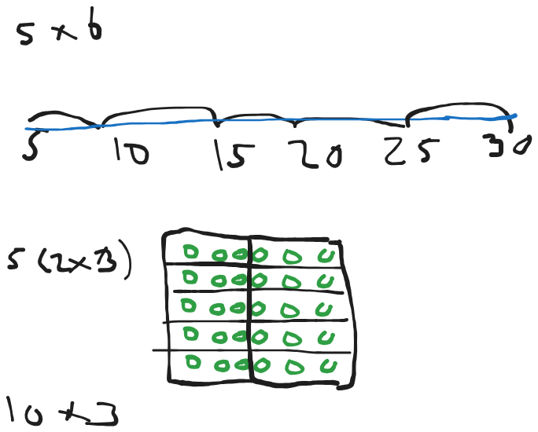

A book about algebra is a one i need to advance my mathematical thinking. It begins with some introduction to basic arithmetic which is very convinient in our decimal system that we know today. 

Let's start by understanding a few properties that exists when we work with numbers such as doing arithmetic. First the **commutative law**, the **associative law** and the **distributive law**. 

### The commutative law
The commutative law states that the order in which we add terms does not change the result. This holds for both addition and multiplication and we can write the general property as

$a+b = b + a$ 

$ab = ba$.  

### The associative law
The associative law expresses that when we add or multiply numbers the order of the way we do it is not going to matter. Which means $(3+5) + 11$ is the same as $3 + (5+11)$. We can write the general property as 

$(a+b) + c = a + (b + c)$

$(a*b) * c = a * (b * c)$

### The distributive law

The distributive law is also for multiplication and addition. It's a rule that describes how we are allowed to work with numbers. 

$(2+3) * 7 = 2 * 7 + 3 * 7 = 35$

It shows that we can add and divide up factors. The general rule is written as

$(a + b) * c = a * c + b * c$

When we multiply numbers there are then many different ways we can do this. We can always try to make the multiplication simpler is there is some specific numbers we are particularly good at working with. For example 9x7 is the same as 4x5x7 which might be easier for us to work with. This sort of manipulation becomes more visible if we draw. We can also say (-1x7)+(10x7) that would also yield the same result. Thinking in these groups of equals and using the properties allowed we can make multiplication easier and more fun.

# Letters in algrebra

 