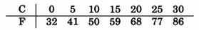
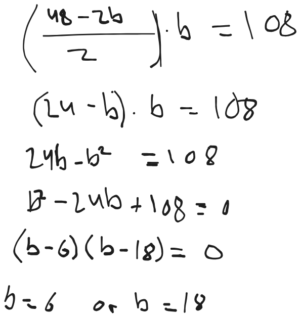
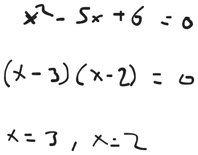

## Exercises chapter 1

Most of the time solving mathematical problems not only is a matter of computation, but perhaps more a matter of translating some problem into mathematics which might be written or stated in plain language. 

The book mentions some simple strategies for getting started on unfamiliar problems. 

1. Understand the problem and approach it logically
2. Substitutions allow us to simplify expressions or to introduce useful new expressions
3. When there are only a few possibilities, analysis by cases may help eliminate all possibilities except the conclusion
4. Check whether the answer is reasonable

As an example the book introduces the problem of multiplying 598 with 602. To solve this we might use a tactic of knowing that $x^2 - y^2$ = $(x+y)(x-y)$. If we let $x= 600$ and $y=2$ we can see that, it suffices to find (602)(598) and we can write that as $(600-2)(600+2)$ which in turn is $600^2$ - $2^2$ = 360000 - 4 = 359996. 

This was a example of using substitution a very powerful mathematical tool that we can use to solve problems.

## 1.1 
We have many tables and many chairs. Let *t* be the number of tables, and let *c* be the number of chairs. Write down an inequality that means "We have at least four times as many chairs as tables".

If we write $c >= 4t$ it means we have atleast four times as many chairs. Because consider if *t* is 5 then this equality says that *c* is greater than or equal to $4*5=20$ which makes the statement hold

## 1.2
Fill in the blanks. The equation $x^2 + bx + c = 0$ has exactly one solution when _______, and it has no solutions when ______

The equation $x^2 + bx + c = 0$ has exactly one solution when the equation only crosses the *y*-axis in a cartesian coordinate system for *x*, and it has no solutions when no *x* values produces the solution to the equation. 

## 1.3
Given that $x+y = 100$, what is the maximum value of $xy$?

If we substitude $y = 100 - x$ so $xy = x(100 -x) = 100x - x^2$. Then we take the derivate, set to 0, that is $100 - 2x = 0$ which equals $x=50$

Somehow i know it's 2500 when $x=50$ and $y=50$ but i am not sure how to logically prove it other than showing the result of very possible multiplication. 

## 1.4 
Explain why the square has the largest area among all rectangles with a given perimeter. 

The square the is geometric shape which presevere most of the area whereas circles for example reduce the area more. 

## 1.5 

Consider the Celcius (C) and Fahrenheit (F) temperature scales. 

Express the sentence "The temperature was 10 C and increased by 20 C using the Fahrenheit scale"

"The temperature was 50 F and increased by 36 F". 

## 1.6 
At a given moment, let *f* and *c* be the value of the temperature on the Fahrenheit and Celsius scales, respectively. These values are related by $f = (9/5)c + 32$. 

At what temperatures do the following events occur?

1. The Fahrenheit and Celsius values of the temperature are equal.
2. The Fahrenheit value is the negative of the Celsius value
3. The Fahrenheit value is twice the Celsius value

To calculate this we might set $c= 0$ and then isolate $c$ to find the answer. 

$f = (9/5)0 + 32$

$f = 32$

For 1) That means every time $f-c = 32$ then the temperatures are the same. 

For 2) i don't see whenevner the Fahrenheit should be negative if C is not. 
$-5 = (9/5) + 32$

For 3) when $2c = (9/5)c + 32$ to solve for $c$ here we first move 32 so we have 
$-32 + 2c = (9/5)c$ 

$(-32)/c + (2c)/c = (9/5)$.  

$(-32)/c + 2 = (9/5)$ 

$c + 2 = (9/5)*-32$ 

$c + 2 = -57,6$

$c = -59,6$ 

So when $c$ is -59,6 then $f$ is twice the Celsius value. We can check that by plotting it into the original equation. 

$f = (9/5)-59,6 + 32$ 

## 1.17 
What are the domain and the image of the absolute value function?

The domain is the set of real numbers from negative infinity to infinity and the image is the set of positive integers. 

# 1.18
Determmine which real numbers exceed their reciprocals by exactly 1. 

# 1.19
What are the dimensions of a rectangular carpet with perimeter 48 feet and area 108 square feet? Given positive numbers *p* and *a*, under what conditions does there exist a rectangular carpet with perimeter *p* and area *a*? 

So we have that the sides *a*, *b* that make up the rectangle together are 48 feet so we have that 

That gives us the following two equations. 

$2a + 2b = 48$ and $a * b = 108$. 

We want to try and isolate one of the variables and then substitute that into the area equation. we do that as follows

So we find that the dimensions are 6 ft and 18 ft which yields $p = 2(6) + 2(18) = 48$ and an area $a = 6 * 18 = 108$. 

The questions also asks under which conditions does there exist a rectangular carpet with perimeter *p* and area *a*? To find that we can create a general condition by replacing 48 with $p$ and 108 with $a$. Which yields

$b^2 - \frac p 2 b + a = 0$

When the descriminant is non-negative this yields real postiive solutions 

$(\frac p 2)^2 - 4a \ge 0 \rightarrow p^2 \ge 16a$

So that a rectangular carpet with perimeter $p$ and area $a$ exists when $p^2 \ge 16a$ and equally $p^2 = 16a$ gives a square. 

# 1.20 
Suppose that $r$ and $s$ are distinct real solutions of equation $ax^2 + bx + c = 0$ in terms of $a$, $b$, $c$ obtain formulas for $r + s$ and $rs$. 

When we look at a simpler quadratic equation like this one below it seems that the sum and product of two solutions equal the value of the coefficients in the original function, here 5 and 6. 

In this example the quadratic equation has coefficient $a = 1$ because the coefficient of $x^2$ is 1. In the general case which this problem asks about $a$ might not be 1 in $ax^2 + bx + c = 0$. To obtain the formulas we can use the **Veita's formulas** which state that

$r + s = \frac {-b} a$, $r * s = \frac c/a$ that means when we introduce coefficients for $a$ we simply divide the coeffiecient for $b$ and $c$ by $a$. 